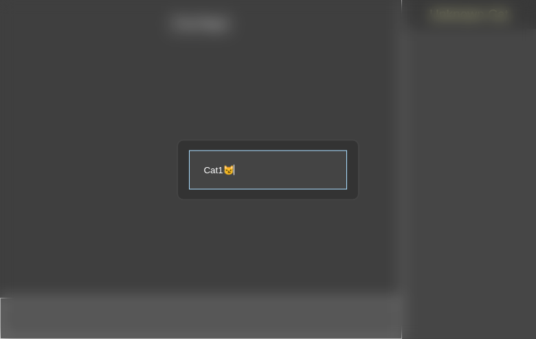
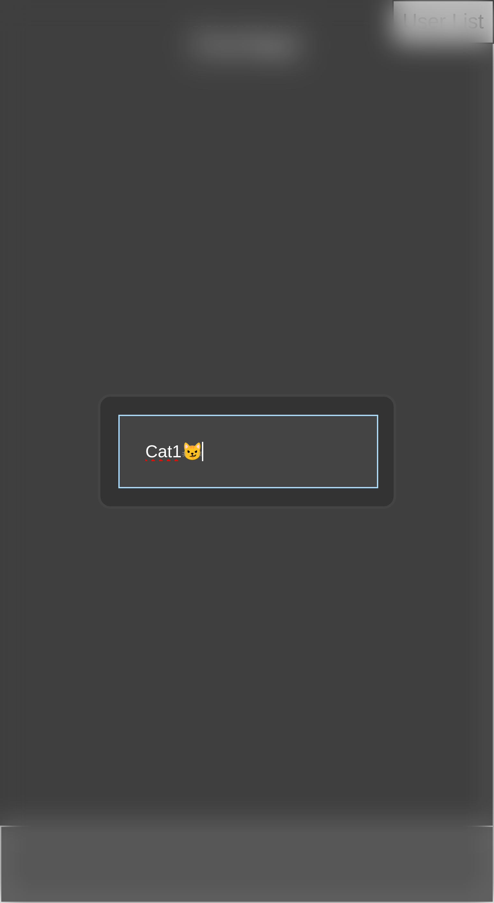

# CatRoom
register [demo-page](https://kaliiiiiiiiii.github.io/CatRoom/cat_room/static/)

#### Dependencies

- [Python ~= 3.10](https://www.python.org/downloads/release/python-31011/)

#### Startup server
(assumes [git-cli](https://git-scm.com/download/win) is installed) \
download and install requirements with
```shell
git clone https://github.com/kaliiiiiiiiii/CatRoom.git
cd CatRoom
python -m pip install --upgrade -r requirements.txt
```

start server \
(serves on all interfaces => `LAN`//`WLAN`)
```shell
python main.py
```

or from python:
```python
from cat_room.serve import Server

if __name__ == "__main__":
    server = Server(port=80, host="localhost")
    server.serve()
```
this serves **on `localhost` only**. To expose the port to `LAN`//`WLAN`, use `host="0.0.0.0"` instead

then, open [localhost](http://localhost) to view the chatroom


### Example screenshots

#### Desktop



#### Mobile
<p float="left">
    
    
</p>


## Authors

- Aurin Aegerter (aka Steve)
- The-AnOnym
